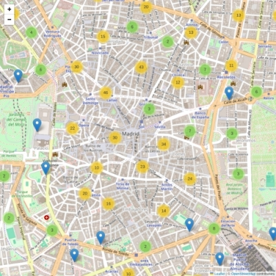
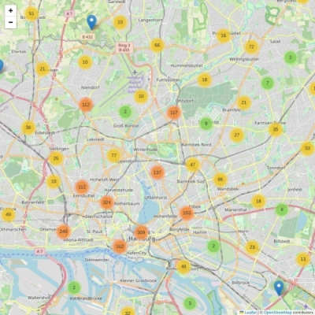

# Safe Browsing for Users With Cognitive Disabilities Based on Curated Websites

Individuals with intellectual disabilities, such as Down syndrome, may struggle to interpret online content and can be vulnerable to even seemingly harmless inappropriate information

Blacklisting is ineffective because inappropriate content for individuals with cognitive disabilities exists across the web, not just on a predefined set of websites

SafeWeb automates the curation of a whitelist of minor websites, reducing reliance on manual compilation and frequent caregiver intervention

The minor websites are particularly important because they include locally relevant resources, such as social centers and community hubs


Image from [www.freepik.com](www.freepik.com)

# Coverage

Australia (AU), Austria (AT), Belgium (BE), Canada (CA), Czech Republic (CZ), Denmark (DK), Finland (FI), France (FR), Germany (DE), Great Britain (GB), Italy (IT), Japan (JP), Netherlands (NL), Poland (PL), Portugal (PT), Slovakia (SK), Spain (ES), Sweden (SE), Switzerland (CH), United States (US)

# Content

Source code of the method [safeweb-method.ipynb](safeweb-method.ipynb)

Processed data for countries [result-method](result-method)

Example application [safeweb-practical.ipynb](safeweb-practical.ipynb) 

Validation ground truth [ground-truth](ground-truth)

Coverage maps [result-visual](result-visual)

# Coverage examples

SafeWeb coverage in Madrid city centre, Spain



SafeWeb coverage in Hamburg metro area, Germany



# Caching

SafeWeb data processing may take a long time due to extensive data retrieval and processing

REST API call cache is implemented to speed up the OpenStreetMap requests

```python 
memory = Memory(location=f'__cache',verbose=0)
```

# Acknowledgements 
Mapping data and geocoding from [OpenStreetMap](https://openstreetmap.org/copyright)
