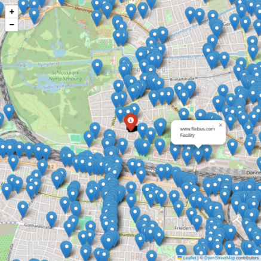
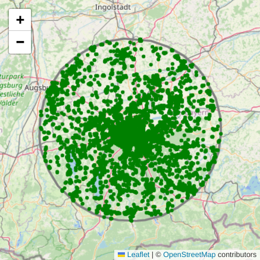
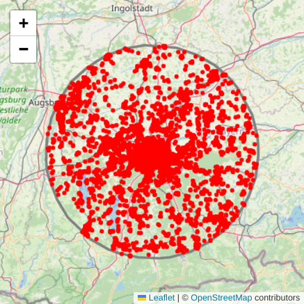
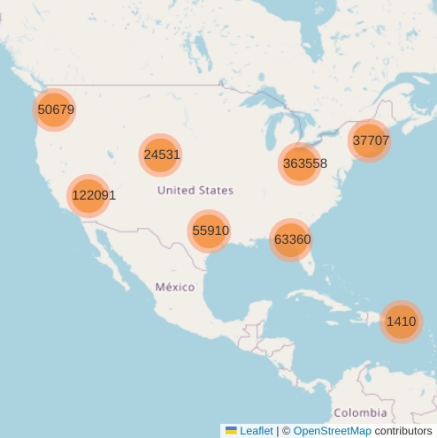
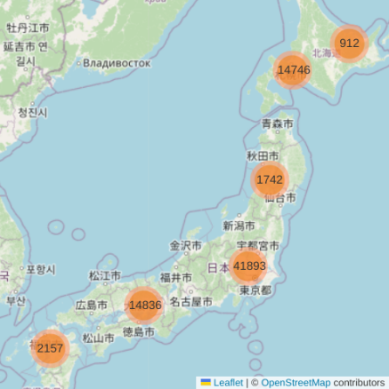

# SafeWeb: Enabling Safe Browsing for Users With Cognitive Disabilities Based on OpenStreetMap Data

Adult individuals with light to moderate intellectual and developmental disabilities, such as Down syndrome, are motivated to live independently with support from their caregivers, typically family members or professional assistants. To fully foster their independence, they should have access to the Internet. Individuals with intellectual disabilities could be victims of even simple scams.

SafeWeb provides a curated list of websites specific to the extended living area. This whitelist can be easily imported into a web browser for supervised access to online content.



Visual representation of curated whitelisted websites in an area where an individual with intellectual disabilities lives. Red icon: residential location, blue icons: whitelisted websites.

# Coverage

Australia (AU), Austria (AT), Belgium (BE), Canada (CA), Czech Republic (CZ), Denmark (DK), Finland (FI), France (FR), Germany (DE), Great Britain (GB), Italy (IT), Japan (JP), Netherlands (NL), Poland (PL), Portugal (PT), Slovakia (SK), Spain (ES), Sweden (SE), Switzerland (CH), United States (US)

# Content

Source code of the method is in [safeweb-core-method.ipynb](safeweb-core-method.ipynb)

Processed data for countries are in [result-core-method](result-core-method)

Example application is shown in [safeweb-practical-use.ipynb](safeweb-practical-use.ipynb) 

Example whitelisted websites are in [result-practical-use](result-practical-use)

Country and demo visual maps are in [result-visual-maps](result-visual-maps)

# Visual examples

Whitelisted facility websites (Germany)



Whitelisted commerce websites (Germany)



# Options

Countries to process the SafeWeb data can be set in [safeweb-core-method.ipynb](safeweb-core-method.ipynb)

```python 
COUNTRIES = [
'AU', 'AT', 'BE', 'CA', 'CZ', 'DK', 'FI', 'FR', 'DE', 'GB', 
'IT', 'JP', 'NL', 'PL', 'PT', 'SK', 'ES', 'SE', 'CH', 'US']
``` 

SafeWeb data processing may take a long time due to extensive data retrieval and processing.

REST API call cache is implemented to speed up the OpenStreetMap requests.

```python 
memory = Memory(location=f'__cache',verbose=0)
```

SafeWeb illustrative coverage in the USA



SafeWeb illustrative coverage in Japan



# Acknowledgements 
- Mapping data and geocoding from [OpenStreetMap](https://openstreetmap.org/copyright)